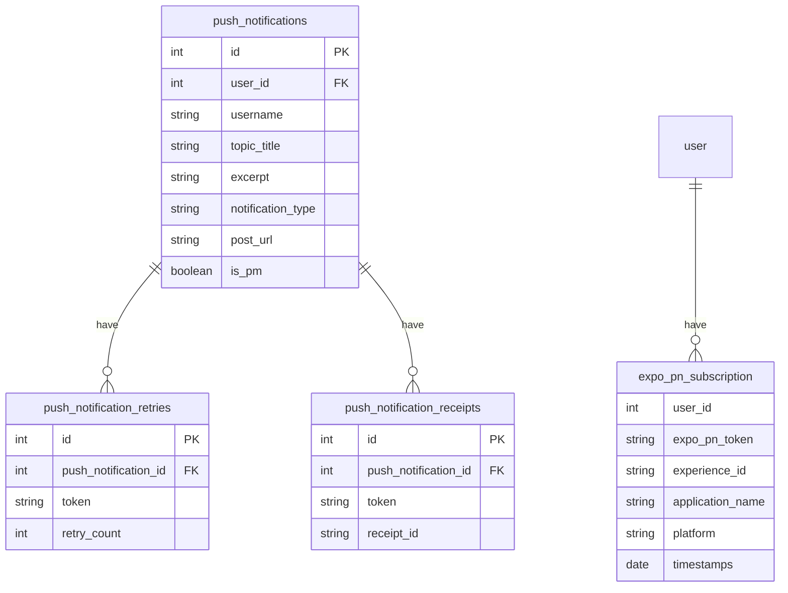

```mermaid
erDiagram
    push_notifications {
      int id PK
      int user_id FK
      string username
      string topic_title
      string excerpt
      string notification_type
      string post_url
      boolean is_pm
    }
    push_notification_retries {
        int id PK
        int push_notification_id FK
        string token
        int retry_count
    }
    push_notification_receipts {
        int id PK
        int push_notification_id FK
        string token
        string receipt_id
    }
    push_notifications ||--o{ push_notification_retries : have
    push_notifications ||--o{ push_notification_receipts : have
    user ||--o{ expo_pn_subscription : have
    expo_pn_subscription {
        int user_id
        string expo_pn_token
        string experience_id
        string application_name
        string platform
        date timestamps
    }
```
