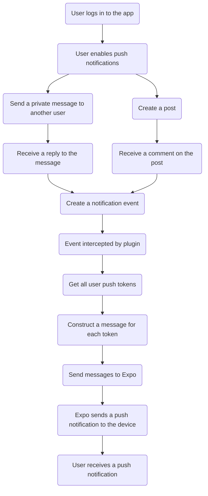

```mermaid
flowchart TD
    UserLogin(User logs in to the app) --> EnablePushNotif(User enables push notifications)
    EnablePushNotif --> SendPrivateMessage(Send a private message to another user)
    EnablePushNotif --> CreatePost(Create a post)
    SendPrivateMessage --> ReceiveMessageReply(Receive a reply to the message)
    ReceiveMessageReply --> CreateEvent(Create a notification event)
    CreatePost --> ReceivePostComment(Receive a comment on the post)
    ReceivePostComment --> CreateEvent
    CreateEvent --> PluginIntercept(Event intercepted by plugin)
    PluginIntercept --> GetAllTokens(Get all user push tokens)
    GetAllTokens --> ConstructMessageForEachToken(Construct a message for each token)
    ConstructMessageForEachToken --> SendMessagesToExpo(Send messages to Expo)
    SendMessagesToExpo --> SendNotificationToDevice(Expo sends a push notification to the device)
    SendNotificationToDevice --> ReceivePushNotifications(User receives a push notification)
```
