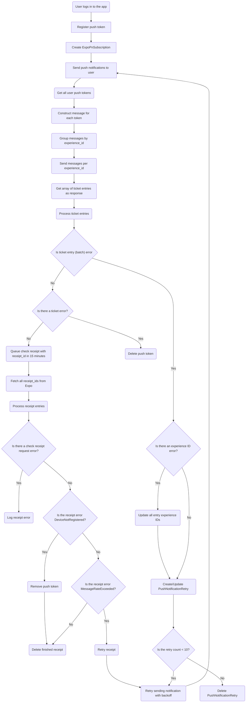

```mermaid
flowchart TD
    %% register push token
    UserLogin(User logs in to the app) --> RegisterPushToken[Register push token]
    RegisterPushToken --> CreateExpoPNSubscription[Create ExpoPnSubscription]

    %% send push notification
    CreateExpoPNSubscription --> SendPushNotificationsToUser[Send push notifications to user]
    SendPushNotificationsToUser --> GetAllTokens(Get all user push tokens)
    GetAllTokens --> ConstructMessageForEachToken(Construct message for each token)
    ConstructMessageForEachToken --> GroupMessagesByExperienceId(Group messages by experience_id)
    GroupMessagesByExperienceId --> SendMessagesPerExperienceId(Send messages per experience_id)
    SendMessagesPerExperienceId --> GetArrayOfTicketsEntryAsResponse(Get array of ticket entries as response)
    GetArrayOfTicketsEntryAsResponse --> ProcessTicketsEntry(Process ticket entries)
    ProcessTicketsEntry --> IsTicketEntryBatchError{"Is ticket entry (batch) error"}
    IsTicketEntryBatchError -->|No| IsTicketError{Is there a ticket error?}
    IsTicketError -->|No| QueueCheckReceipt(Queue check receipt with receipt_id in 15 minutes)

    %% receipts
    QueueCheckReceipt --> FetchAllReceiptIds(Fetch all receipt_ids from Expo)
    FetchAllReceiptIds --> ProcessReceipts(Process receipt entries)
    ProcessReceipts --> IsReceiptRequestError{Is there a check receipt request error?}
    IsReceiptRequestError -->|Yes| LogReceiptError(Log receipt error)
    IsReceiptRequestError -->|No| IsReceiptDeviceNotRegistered{Is the receipt error DeviceNotRegistered?}
    IsReceiptDeviceNotRegistered --> |Yes| RemovePushToken(Remove push token)
    RemovePushToken --> DeleteFinishedReceipt
    IsReceiptDeviceNotRegistered --> |No| IsReceiptMessageRateExceeded{Is the receipt error MessageRateExceeded?}
    IsReceiptMessageRateExceeded --> |No| DeleteFinishedReceipt(Delete finished receipt)
    IsReceiptMessageRateExceeded --> |Yes| RetryReceipts(Retry receipt)
    RetryReceipts --> RetryNotification

    %% tickets
    IsTicketError -->|Yes| DeletePushToken(Delete push token)
    IsTicketEntryBatchError -->|Yes| IsExperienceIdError{Is there an experience ID error?}
    IsExperienceIdError -->|Yes| UpdateAllEntryExperienceId(Update all entry experience IDs)
    UpdateAllEntryExperienceId --> CreateOrUpdatePushNotificationRetry(Create/Update PushNotificationRetry)
    IsExperienceIdError -->|No| CreateOrUpdatePushNotificationRetry
    CreateOrUpdatePushNotificationRetry --> IsRetryCountLessThan10{Is the retry count < 10?}
    IsRetryCountLessThan10 -->|No| DeletePushNotificationRetry(Delete PushNotificationRetry)
    IsRetryCountLessThan10 -->|Yes| RetryNotification(Retry sending notification with backoff)
    RetryNotification --> SendPushNotificationsToUser
```
